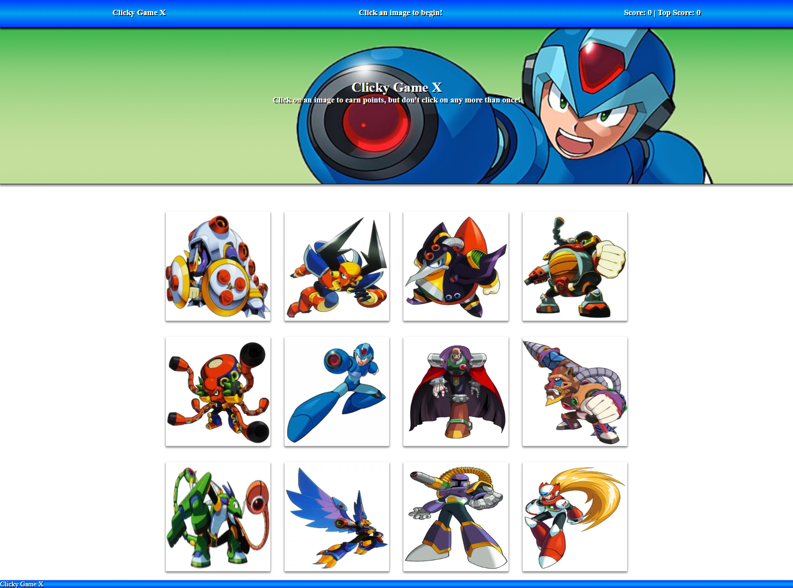

# Clicky Game X

A Mega Man X memory game created with React.js

## Purpose

The purpose of this project was to understand how to use React.js, as well as a defining a state in the application, and passing along it's properties into individual components. This enables dynamic generation of content in the application - in this case, the individual character photos presented - and groupd of HTML, CSS, and Javascript in the same instance, as opposed to having to connect the three seperate files and folders.

## Screenshots

## Technologies Used

* HTML
* CSS
* React.js
* Photoshop (for the banner coloration )

